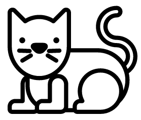
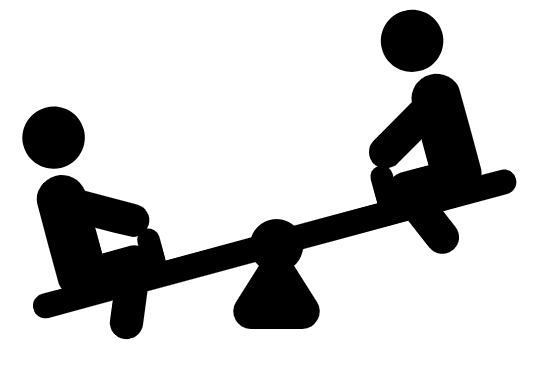

# Cvičení: Transformace

## Kočka

1. Pohlaď kočku.
1. Kočka se při pohlazení ráda krčí.
1. Na kliknutí ji zmenšit po ypsilonové ose.

## Houpačka

1. Otoč houpačku tak, aby bylo levé dítě na zemi.
1. Při kliknutí na `.houpacka` otoč `.houpacka__deti`, aby bylo druhé, levé dítě na zemi.
1. Pro stav kliknutí využij pseudotřídu `.houpacka:active`.

